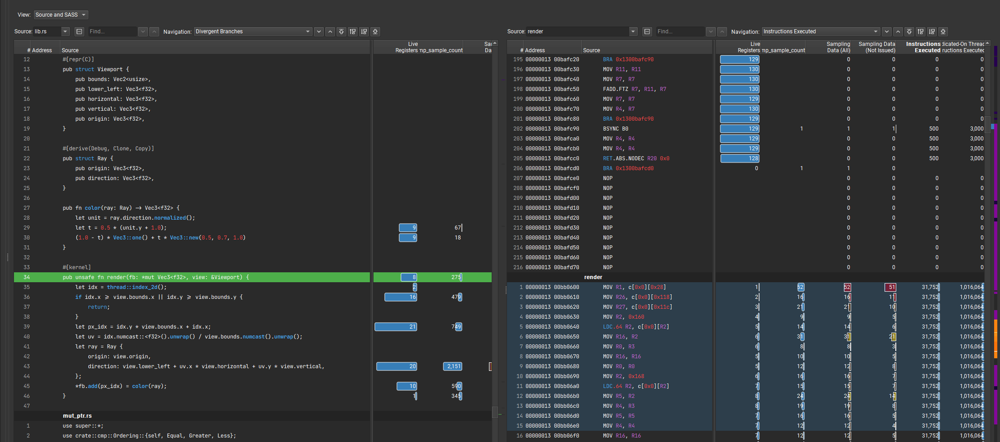

# Debugging The Codegen 

When you try to compile an entire language for a completely different type of hardware, stuff is bound to
break. In this section we will cover how to debug 🧊, segfaults, and more.

## Segfaults 

Segfaults are usually caused in one of two ways:
- From LLVM when calling it through FFI with some bad stuff (bad values, bad types, etc).
- From NVVM when linking (generating PTX). (more common)

The first case can be debugged in two ways:
- Building the codegen in debug mode and using `RUSTC_LOG="rustc_codegen_nvvm=trace"` (`$env:RUSTC_LOG = "rustc_codegen_nvvm=trace";` if using powershell).
Note that this will dump a LOT of output, and when i say a LOT, i am not joking, so please, pipe this to a file.
This will give you a detailed summary of almost every action the codegen has done, you can examine the final few logs to 
check what the last action the codegen was doing before segfaulting was. This is usually straightforward because the logs are detailed.

- Building LLVM 7 with debug assertions. This, coupled with logging should give all the info needed to debug a segfault. It should 
get LLVM to throw an exception whenever something bad happens.

The latter case is a bit worse.

Segfaults in libnvvm are generally because we gave something to libnvvm which it did not expect. In an ideal world, libnvvm would
just throw a validation error, but it wouldn't be an llvm-based library if it threw friendly errors ;). Libnvvm has been known to segfault 
on things like:
- using int types that arent `i1`, `i8`, `i16`, `i32`, or `i64` in functions signatures. (see int_replace.rs).
- having debug info on multiple modules (this is technically disallowed per the spec but it still shouldn't segfault).

Generally there is no good way to debug these failures other than hoping libnvvm throws a validation error (which will cause an ICE).
I have created a tiny tool to run `llvm-extract` on an llvm ir file to attempt to isolate segfaulting functions which works to some degree
which i will add to the project soon.

## Miscompilations 

Miscompilations are rare but annoying. They usually result in one of two things happening:
- CUDA rejecting the PTX as a whole (throwing an InvalidPtx error). This is rare but the most common cause is declaring invalid
extern functions (just grep for `extern` in the ptx file and check if its odd functions that arent cuda syscalls like vprintf, malloc, free, etc).
- The PTX containing invalid behavior. This is very specific and rare but if you find this, the best way to debug it is:
  - Try to get a minimal working example so we don't have to search through megabytes of llvm ir/ptx.
  - Use `RUSTFLAGS="--emit=llvm-ir"` and find `crate_name.ll` in `target/nvptx64-nvidia-cuda/<debug/release>/deps/` and attach it in any bug report.
  - Attach the final PTX file. 

That should give you an idea of who is responsible for the miscompilation, if it is us, LLVM, or NVVM. Which should allow you to isolate the cause
and file a bug report to LLVM/NVIDIA and generate different IR to avoid it.

If that doesn't work, then it might be a bug inside of CUDA itself, but that should be very rare. The best way to debug that (and really the only way)
is to set up the crate for debug (and see if it still happens in debug). Then you can run your executable under NSight Compute, go to the source tab, and 
examine the SASS (basically an assembly lower than PTX) to see if ptxas miscompiled it.

If you set up the codegen for debug, it should give you a mapping from rust code to SASS which should hopefully help to see what exactly is breaking.

Here is an example of the screen you should see:

